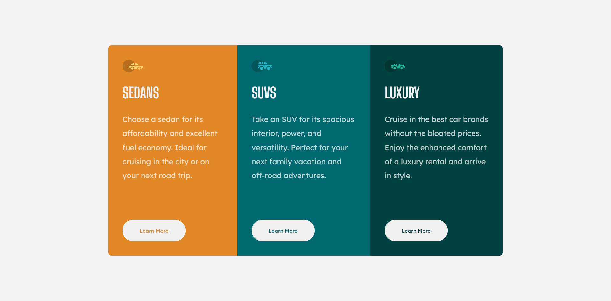

# Frontend Mentor - 3-column preview card component solution

This is a solution to the [3-column preview card component challenge on Frontend Mentor](https://www.frontendmentor.io/challenges/3column-preview-card-component-pH92eAR2-). Frontend Mentor challenges help you improve your coding skills by building realistic projects. 

### The challenge

Users should be able to:

- View the optimal layout depending on their device's screen size
- See hover states for interactive elements

### Screenshot

### Links

- Solution URL: [GITHUB Code](https://github.com/moordu/moorducard.github.io)
- Live Site URL: [Live Site](https://moordu.github.io/moorducard.github.io/)

## My process

### Built with

- Semantic HTML5 markup
- CSS custom properties
- Flexbox
- Mobile-first workflow

### What I learned

I learned how to more confidently use CSS properties and Flexbox, along with :hover properties on buttons.

## Author

- Moordu
- Frontend Mentor - [@moordu](https://www.frontendmentor.io/profile/moordu)

